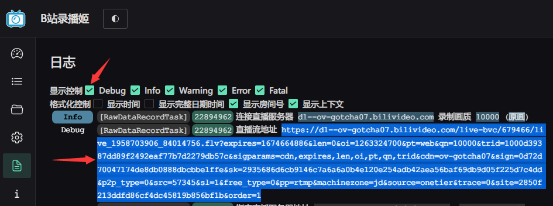

# Bilibili直播自动追帧

https://greasyfork.org/zh-CN/scripts/453967

**从0.4.2版本更新时建议删除脚本后重新安装**

## 主要功能

对bilibili的直播进行追帧以实现低延迟的直播播放，从而提供近乎实时的弹幕互动、或是用于同传追帧等

脚本加载后，会在直播界面右上方粉丝团处生成配置项，可以根据网络情况设定追帧的目标缓存时长

小样本测试下原画的HLS(fMp4)和二压的flv相比延迟仍较高，建议优先使用HTTP-FLV协议的推流

## 次要功能

- 0.6.12
	- 在高级设置中可以开关降低播放速度和设置降低播放速度的缓存阈值
- 0.6.6
    - 自定义API：可以自定义获取playurl所用的API endpoint：https://github.com/c-basalt/bilibili-live-seeker-script/issues/1
- 0.6.3
    - 重置音画同步：（实验）让音视频重新定位来尝试重置音视频的不同步，并提供定时自动重置
- 0.6.2
    - 设置链接：支持直接使用完整的直播流flv链接，如使用B站录播姬日志中的“直播流地址”。

- 0.5.6
	- 自动刷新：（添加行为）在下播期间检测到弹幕一直无变化，且开启了“阻止轮播”时，自动刷新网页
- 0.5.3
	- 自动原画：自动选择最高画质
	- 避免暂停：自动恢复暂停的直播流为播放状态，避免因暂停导致直播流重新加载
	- 强制原画/复制链接/设置链接：当前B站直播已经会对“原画”进行二压，开播约10秒-1分钟后获取的“原画”均为不高于6Mbps的二压推流，会**额外产生2-3秒量级的延迟**。刚开播时可以获取`live_000000_0000.flv`链接格式的真实原画推流，而之后的“原画”只能获取`live_000000_0000_bluray.flv`链接格式的二压推流 
	新添加的功能可以缓存开播时获取的真实原画链接（有效期1小时，但不刷新可一直使用），并拦截浏览器的请求，避免浏览器使用二压推流。如果开播前没有开启浏览器直播间，则可以通过“设置链接”来添加有效的原画链接信息（[示例](http://oss.cbasalt.ml/public/playurl.txt)，[其他示例](http://oss.cbasalt.ml/public/playurls.html)）
	- 阻止轮播：自动阻止直播间轮播，方便提前开启直播间页面待机，以获取原画推流降低延迟
- 0.4.2
	- 强制avc+flv：强制采用HTTP-FLV协议，并使用H264(AVC)码流，从而避免HLS协议/H265(HEVC)转码带来的额外延迟
	- 自动刷新：（未充分测试）直播期间检测到直播间连接失败信息时、下播状态下主播开播后没有自动开始播放直播时（每3分钟检测一次，推测是和弹幕服务器连接断开导致），自动刷新网页
	- 缓存时长极低时降低播放速度

## 需求和问题反馈

可以[通过B站联系我](https://space.bilibili.com/521676)，但修不修看我个人兴趣。建议直接自己动手更快

## 原理

简单的说，实时的视频流直播不可避免的会有网络波动的问题，因而**画质**、**稳定性**、**延迟**只能三选二。
对于直播平台这种面向多数人的内容的直播，一般会优先画质和稳定性，即保持良好画质的同时，尽可能保证播放的流畅，避免频繁的卡顿加载影响体验。

所以在实际播放直播的视频推流的时候，播放器并不是立刻播放从服务器收到的视频流，而是会在本地缓存4-20秒的时长。这样即便有网络波动，只要波动在缓存时长的范围内，对于用户而言就是无感的，从而可以保证大部分环境下的流畅的直播观看体验。但是其代价则是视频流必须经过数秒的缓存才会播放，这就给直播的播放带来了等同于缓存时长的延迟。而事实上网络稳定时，绝大部分的延迟都是在本地缓存产生的。

追帧脚本则是通过HTML5播放器的HTMLMediaElement.playbackRate API来控制播放的速率，在缓存过长时加速播放，提前播放视频流消耗本地缓存，从而减少由于本地缓存带来的延迟。换言之，就是放弃播放的稳定性，来换取播放的低延迟。事实上使用稳定的PC网络播放直播时，出现大幅波动的情况并不多，即便相对激进地设置1.0-1.5秒的延迟，也能大部分时间获得流畅的直播。并且由于追帧后的低延迟，发送的弹幕几乎可以同步地出现在画面的弹幕机上，直播的交互体验可以大幅地提升。

在bilibili直播中常见的同传，其基础也是各自采用的追帧工具。通过追帧，同传man可以实现远低于一般观众的本地延迟，相同的内容可以比一般观众早4-10秒看到。这个延迟的时间差构成了同传的基础，即只要同传man在这4-10秒内完成打字翻译，那么在其他观众看来，同传弹幕就是和主播的语音同时、甚至更早出现的。

对追帧在同传中应用的讨论可以参考我的这篇专栏：[简述追帧的原理和追帧在直播同传的中的使用](https://www.bilibili.com/read/cv21206210)
